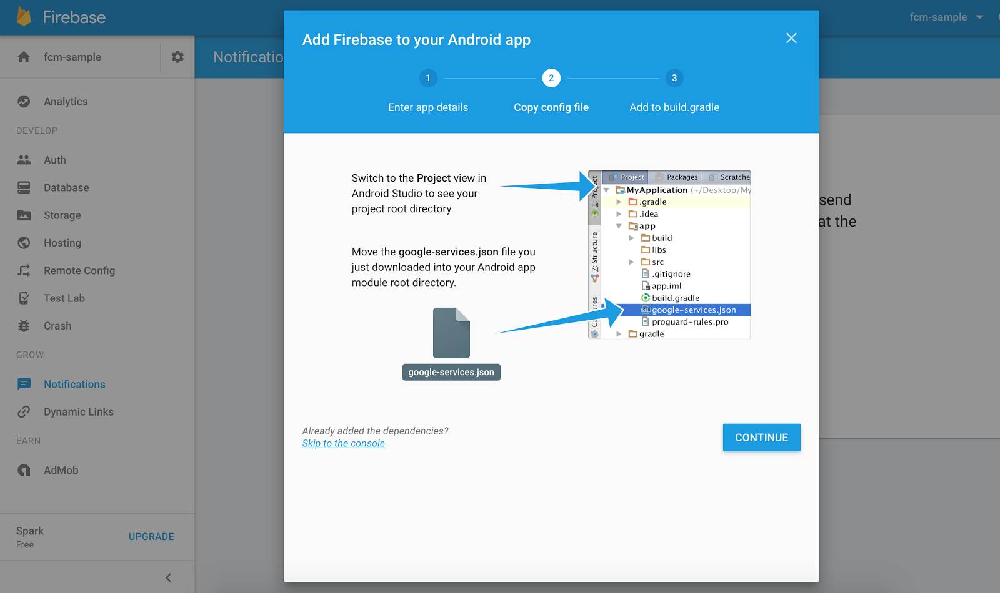

# Jubi.AI Android ChatBot
Android Plugin to implement chatbot

# Setup
## 1. Include in your project

#### Using Gradle
The **JubiAi Chatbot** library is pushed to jcenter, so you need to add the following dependency to your app's `build.gradle`.

```gradle
repositories {
    ...
    maven { url 'https://dl.bintray.com/darpan/maven/' }
}

dependencies {
    ...
    implementation 'com.jubi.ai:jubiai-chatbot:1.8'
}
```

## 2. Integration

Next step is to configure the `jubiai-chatbot`.

Example:

```java
private ChatBotConfig chatBotConfig() {
        ChatBotConfig chatBotConfig = new ChatBotConfig();
        chatBotConfig.setAppLogo("drawable resource");
        chatBotConfig.setMaterialTheme(MaterialTheme.RED);
        chatBotConfig.setTitle("Some Title");
        chatBotConfig.setSubTitle("Some subtitle");
        chatBotConfig.setProjectId("Some project id");
        chatBotConfig.setPath("android");
        chatBotConfig.setHost("some domain like https://xyz.com");
        chatBotConfig.setFcmToken(FirebaseInstanceId.getInstance().getToken());
        chatBotConfig.setAttachmentRequired(by default is true);
        chatBotConfig.setPersistentMenu("Comma seperated menus");
        return chatBotConfig;
}
```
Next step is to save ChatBotConfig.

```java
@Override
protected void onCreate(Bundle savedInstanceState) {
    ...
    ChatBotActivity.setUp(this, chatBotConfig());
}
```

Next step is to setup Widget(if required) in your layout, click listener is handled internally.

```xml
<com.jubi.ai.chatbot.views.widget.InAppChatWidget
        android:id="@+id/inAppChatWidget"
        android:layout_width="60dp"
        android:layout_height="60dp"
        android:layout_marginEnd="16dp"
        android:layout_marginRight="16dp"
        android:layout_marginBottom="16dp"
        android:elevation="4dp"
        app:layout_constraintBottom_toBottomOf="parent"
        app:layout_constraintEnd_toEndOf="parent"
        app:widgetIcon="@drawable/ic_android"></com.jubi.ai.chatbot.views.widget.InAppChatWidget>
```
## 3. Set Up Android FCM

FCM push notifications setup

Below, we’ll show you how to send push notifications and/or push messages to your customers, with Firebase Cloud Messaging (FCM) in Jubi.AI.

### Step 1. Enable Google services for your app

If you already have a Firebase project with notifications enabled you can skip to the next step. Otherwise go to the [FCM Console page](https://console.firebase.google.com/?pli=1) and create a new project following these steps:

Give the project a name and click **Create Project**.


Once your project is set up, scroll down and select ‘Get started’ on the ‘Notifications’ card.


Enter your app’s package name and click ‘Add App’.


### Step 2. Setup client to receive push

Your google-services.json should automatically download. You’ll need to move that into the same directory as your application level build.gradle



In your apps build.gradle you will need to add the following lines to your dependencies:

```
dependencies {
    compile 'com.google.firebase:firebase-messaging:11.+'
}
```

At the bottom of your build.gradle you must add:

```
apply plugin: 'com.google.gms.google-services'
```

It is important that this is at the very end of the file.

### Step 3. Add your Server key to Jubi.AI for Android settings

Finally, click the settings cog and select ‘Project settings’, then ‘Cloud Messaging’ and copy your Server key.


Open your Jubi.AI app’s settings and select ‘Jubi.AI for Android’. Then find the ‘Enable Google Cloud Messaging’ section. Here you'll be able to paste and save your Server API key.

### Step 5. Save FCM token

After you've obtained the token, you can save FCM token in chatbot. For Example.

```java
chatBotConfig.setFcmToken(FirebaseInstanceId.getInstance().getToken());
```


